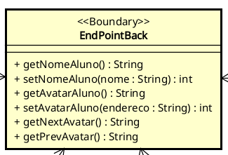
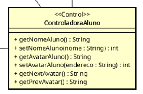
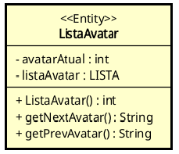
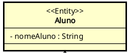
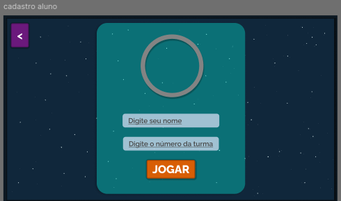
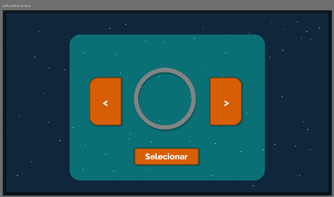

UNIVERSIDADE FEDERAL DE VIÇOSA · UFV \- CAMPUS FLORESTAL  
CIÊNCIA DA COMPUTAÇÃO  
PROJETO INTEGRADOR 2024

# **BACKLOG DA SPRINT 01 \- CSU03**

Guilherme Broedel Zorzal \- 5064   
Arthur Fernandes Bastos \- 4679

Florestal \- MG   
Outubro de 2024

# **LISTA DE FIGURAS**

[**Figura 1**: Classe End-Point do Back para guardar as rotas.](#image-1)\
[**Figura 2**: Classe controladora para a classe Aluno.](#image-2)\
[**Figura 3**: Classe para Lista de Avatares.](#image-3)\
[**Figura 4**: Classe Aluno.](#image-4)\
[**Figura 5**: Tela inicial do projeto.](#image-5)\
[**Figura 6**: Tela de cadastro de Aluno.](#image-6)\
[**Figura 7**: Tela de seleção e troca de avatar.](#image-7)

# **SUMÁRIO**

1. [INTRODUÇÃO](#introdução)  
2. [CASO DE USO](#caso-de-uso)  
3. [BACK-END](#back-end)  
3.1. [Devs Seniors](#devs-seniors)  
  [EndPointBack](#endpointback)  
  [ControladoraAluno](#controladoraaluno)  
3.2. [Dev Juniors](#dev-juniors)  
  [ListaAvatar](#listaavatar)  
  [Aluno](#aluno)  
4. [FRONT-END](#front-end)  
4.1 [End-points](#end-points)

# INTRODUÇÃO

O objetivo do seguinte documento consiste em apresentar especificações relacionadas ao caso de uso abordado na primeira sprint, de acordo com o product backlog proposto com base no calendário.

Uma convenção importante com relação aos diagramas de classe: caso a representação da classe não possua nenhum método, deve-se entender que a classe precisa de possuir getters e setters para seus atributos, a menos que tenham sido dadas outras instruções na descrição da classe presente no documento.

#  CASO DE USO

O caso de uso abordado na Sprint atual ficou decidido como sendo o CSU03: Selecionar personagem. Sua especificação, proposta na documentação dos casos de uso em ESOF I, pode ser conferida abaixo. Note que o caso de uso não sofreu alterações em relação ao proposto originalmente, ou seja, o fluxo proposto inicialmente continua sendo o mesmo.

Esse caso de uso é o caso de uso responsável por realizar a seleção do avatar do aluno. A documentação do caso de uso pode ser encontrada abaixo.  
Uma das modificações que foi realizada no caso de uso em si foi sua renomeação para “Selecionar Avatar”. Foi decidido unanimemente entre os Designers de Arquitetura que essa nomenclatura seria mais clara e fácil de compreender.

    CSU03: Selecionar Avatar  

    Nome:  Selecionar Avatar.
    
    Ator Primário: Aluno. 

    Sumário: O aluno deve ser capaz de selecionar o avatar que o representa melhor, dentre os disponíveis no jogo.
    
    Pré-condições: Nenhuma. 

    Fluxo Principal: 
    
      1. O sistema exibe um conjunto de avatares prontos para o usuário;

      2. O usuário escolhe uma dentre as opções; 

      3. O sistema requisita que o usuário confirme sua escolha;
      
      4. O usuário confirma sua escolha; O avatar é alterado.
    
    Fluxo alternativo (2): Usuário escolhe sair do menu 
    
      a. Se o usuário escolher sair, o sistema retorna para a tela anterior.

    Fluxo alternativo (4): Usuário cancela sua escolha 

      a. Se o usuário optar por cancelar sua escolha, o caso de uso recomeça do passo 1.

    Pós-condições: O avatar do aluno selecionado pelo aluno foi salvo corretamente.

#  BACK-END

O backend, na sprint atual, ficará responsável pela implementação de algumas classes e relações envolvendo o Aluno e o Avatar, além de criar uma lista circular para a seleção de avatares.

## Devs Seniors

A principal função dos devs seniors na sprint atual será a da criação e gerenciamento dos end-points através das classes “EndPointBack” e “ControladoraAluno”.

### EndPointBack

A classe EndPointBack é a classe responsável por receber as requisições enviadas pelo front e responder de forma adequada ao que foi solicitado. Essa classe será uma classe de fronteira cuja única função é tratar os endpoints. Toda lógica que será executada por cada rota fica terceirizada na classe “ControladoraAluno”. Essa escolha foi realizada dessa forma visto que com o aumento de endpoints nas próximas sprints, a classe se tornaria muito desorganizada.

###### **Figura 1**: Classe End-Point do Back para guardar as rotas.

Os campos de retorno dos JSONs devem ser os mesmos campos utilizados nas classes. Por exemplo, o nome do aluno deve ficar localizado no campo “nomeAluno” do JSON.

Os endpoints que devem existir serão:

* /aluno  
  * /nome   
    * GET: retorna o nome do aluno  
    * POST (nomeAluno): guarda o nome do aluno  
  * /avatar  
    * GET: retorna o endereço do arquivo que contém o avatar selecionado pelo aluno  
    * POST: (enderecoArquivo: String): deve guardar o endereco de arquivo escolhido como avatar do aluno  
    * nextAvatar/   
      * GET: retorna o próximo avatar na lista de avatares disponíveis  
    * prevAvatar/   
      * GET: retorna o avatar anterior na lista de avatares disponíveis  
* /images/avatars  
  * GET : Retorna a imagem presente na rota. Essa rota não precisa de implementação. Basta que haja uma pasta /images/avatars dentro da API do back que contenha imagens. É uma pasta normal de imagens, mas que precisa se encontrar dentro do grupo de pastas expostas pelo back

### ControladoraAluno

A classe “ControladoraAluno” vai comandar as ações de troca de avatar e receber o nome do aluno. A ideia dessa classe é ter os gets e sets, onde o nome vai ser enviado para a Classe Aluno, possuir get e set para o avatar atual do aluno, além de um get para o próximo avatar da classe “ListaAvatar” e um para o anterior.

###### **Figura 2:** Classe controladora para a classe Aluno.

Quanto aos métodos a serem criados:

* **getNomeAluno()**:  
  Método responsável por retornar o nome do aluno. Ele recupera a informação previamente armazenada na classe **Aluno**.  
* **setNomeAluno(String nome)**:  
  Método utilizado para definir o nome do aluno. Ele recebe uma string com o nome e o armazena na instância da classe **Aluno**.  
* **getAvatarAtual()**:  
  Retorna o avatar atual selecionado pelo aluno. Esse método acessa a lista de avatares e recupera o avatar que está configurado como o atual.  
* **setAvatarAluno(String enderecoArquivo)**:  
  Define o avatar atual do aluno com base no caminho de um arquivo de imagem. Ele armazena o caminho do avatar escolhido para ser utilizado futuramente.

  (Decidimos armazenar os arquivos de imagem dentro do código do backend então o parâmetro da função é um endereço do arquivo de imagem)

* **getNextAvatar()**:  
  Avança para o próximo avatar na lista circular de avatares. O método retorna o caminho do próximo avatar e atualiza o índice da lista.  
* **getPrevAvatar()**:  
  Voltar para o avatar anterior na lista circular de avatares. Similar ao método de próximo avatar, mas retornando o anterior.

##  Dev Juniors

Com relação aos devs Juniors, o caso de uso atual requer que seja realizada a implementação das seguintes classes: “Aluno” e “ListaAvatar”. As especificações de cada classe serão explicadas abaixo.

###  ListaAvatar

A classe “ListaAvatar” é a classe que será o coração do funcionamento da tela “selecionar avatar”, que pode ser conferida na figura 3 da seção sobre o Front-end. A ideia dessa classe é criar um esquema de “Carrossel” das imagens de avatar: quando o aluno seleciona a próxima imagem no frontend, o backend retorna a próxima imagem guardada no repositório.

Esse processo deve se dar de forma circular, ou seja, uma vez que a lista chegue ao final, o back retorna a primeira imagem novamente.

###### **Figura 3:** Classe para Lista de Avatares.

Os atributos da classe ListaAvatar são os seguintes: 

* **avatarAtual : int** \= O atributo *avatarAtual* deve conter o id do avatar que foi escolhido pelo usuário. Em outras palavras, é o id da lista correspondente ao avatar atual.   
* **listaAvatar : LISTA** \= O atributo *listaAvatar* é a estrutura responsável por efetivamente realizar a simulação de uma lista circular. Essa é a estrutura que será responsável por guardar as imagens dos avatares. A estrutura a ser utilizada fica a critério dos dev juniors (por isso seu tipo está marcado como LISTA), ou seja, pode ser ArrayList, HashSet, LinkedList, etc. O importante é que a classe ListaAvatar se comporte como uma lista circular, a estrutura utilizada não tem importância.

Quanto aos métodos a serem criados, serão esses:

* **ListaAvatar():** esse é o construtor da classe. Quando a classe for instanciada, ela deve carregar os caminhos dos arquivos presentes na pasta de imagens (especificada nos endpoints do backend) e montar a lista circular a partir deles. Além disso, esse método deve setar o atributo *avatarAtual* como sendo 0 (o primeiro avatar da lista). Note que por caminho entende-se o caminho relativo considerando como raiz a rota da api (localhost).  
* **getNextAvatar() : String** \= esse método deve retornar o nome do próximo avatar, ou seja, a string presente na próxima posição da lista. Por exemplo, se o valor de avatarAtual for 3, deve retornar a string presente na posição 4 e setar *avatarAtual* para 4\. Caso a lista tenha tamanho 4 (posições 0,1,2,3), deve retornar a string presente na posição 0 que representa o caminho do arquivo e setar o valor de *avatarAtual* para 0\.   
* **getPrevAvatar() : String** \= realiza praticamente a mesma coisa que o método getNextAvatar, porém pegando o avatar anterior. Utilizando o mesmo exemplo de getNextAvatar, ela setaria o valor de avatarAtual para 2 e retornaria e string presente na posição 2\.  
* **setAvatarAtual(nome : String) : int** \= Por fim, o método setAvatarAtual receberá um caminho de arquivo (a escolha de avatar do aluno) e, com base nisso, seta o valor de avatarAtual para o valor correspondente. Em outras	palavras, o método deve procurar dentro da lista de avatares qual endereço contém a string passada como parâmetro e guardar sua posição em *avatarAtual*.

###  Aluno

A classe “Aluno” é a classe responsável por guardar as informações referentes ao aluno. Sua implementação é extremamente simples: Ela só precisa possuir os seus respectivos getters e setters e o construtor, que deve atribuir uma string vazia ao atributo “nomeAluno”.

###### **Figura 4:** Classe Aluno.

#  FRONT-END

Quanto ao que deve ser implementado pelo front, serão criadas as telas desenvolvidas no figma correspondentes a: “tela inicial”, “cadastro aluno” e “selecionar avatar”. O link do design pode ser encontrado na área inicial do clickup.  Tais telas também podem ser visualizadas abaixo.

###### **Figura 5:** Tela inicial do projeto.

###### **Figura 6:** Tela de cadastro de Aluno.

###### **Figura 7:** Tela de seleção e troca de avatar.

O fluxo das telas deve ser o seguinte:

* Tela inicial:  
  * O botão “Sou aluno” deve redirecionar para a tela “cadastro aluno”  
  * O botão “Sou professor” deve redirecionar para a tela “login professor”. (Como essa tela não é compreendida pelo caso de uso atual, não é necessário realizar a implementação da mesma)  
* Cadastro aluno  
  * O botão “jogar” deve redirecionar para a tela “jogar”, além de enviar ao back uma mensagem para que as informações do usuário sejam salvas. Como o caso de uso “Jogar” não é compreendido pelo caso de uso atual, não há necessidade de realizar a implementação.  
  * Ao clicar no avatar, a tela é redirecionada para “selecionar avatar”  
  * O botão “\<” deve redirecionar para “tela inicial”  
  * O número da turma a princípio não será necessário para jogar, portanto não é necessário realizar nenhuma implementação para esse componente  
* Selecionar Avatar  
  * O botão “X” deve redirecionar para para a tela “cadastro aluno”  
  * O botão “\<” deve alterar o avatar para a próxima possibilidade de avatar disponível  
  * O botão “\>” deve alterar o avatar para a possibilidade de avatar disponível anteriormente  
  * O botão “Confirmar” deve enviar uma mensagem ao back atualizando o avatar do usuário e em seguida redirecionar para a tela “Cadastro aluno”

	Espera-se que o sistema seja robusto, capaz de tratar erros que possam ocorrer no sistema e lidar com situações como falta de preenchimento dos campos obrigatórios.

##  End-points

	  
Os endpoints a serem utilizados pelo front podem ser encontrados dentro da área “endpoints” do capítulo “Backend” deste documento.  