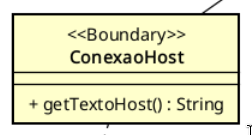

  
UNIVERSIDADE FEDERAL DE VIÇOSA · UFV \- CAMPUS FLORESTAL  
CIÊNCIA DA COMPUTAÇÃO  
PROJETO INTEGRADOR 2024

# **REFINAMENTO DA SPRINT 7** - CSU10: Conexão com a rede

**v.1.0.1**

Guilherme Broedel Zorzal \- 5064   
Arthur Fernandes Bastos \- 4679

Florestal \- MG   
Novembro de 2024


# **LISTA DE FIGURAS**

[**FIGURA 1**: Classe Conexão Host](#image-1)

# **SUMÁRIO**

1. [ATUALIZAÇÕES E CORREÇÕES](#1-atualizações-e-correções)

2. [INTRODUÇÃO](#2-introdução)

3. [CASO DE USO](#3-caso-de-uso)

4. [ESTRUTURA GERAL](#4-estrutura-geral)

5. [BACKEND](#5-backend)

	5.1. [Classe ConexaoHost](#51-classe-conexaohost)

	5.1.1. [getTextoHost](#511-gettextohost)

6. [BANCO DE DADOS](#6-banco-de-dados)

7. [FRONT-END](#7-front-end)

8. [CRIAÇÃO DO VÍDEO](#8-criação-do-vídeo)

9. [ADIÇÃO DE IMAGENS DE AVATAR](#9-adição-de-imagens-de-avatar)

# 1 ATUALIZAÇÕES E CORREÇÕES

Para essa sprint, deve ser realizada a correção de todas as issues abertas no repositório do github. O front-end fica responsável por resolver as questões relacionadas à refatoração do CSU03: Jogar e o back-end responsável pelas relacionadas ao sistema do projeto.


# 2 INTRODUÇÃO

O objetivo do seguinte documento consiste em apresentar o que foi definido para implementação, correção e ajustes finais para serem feitos na sprint 7, foi criado um novo caso de uso que terá como funcionalidade a conexão de rede necessária para o manejamento de requisições dos computadores dos alunos para a máquina do professor, de forma a disponibilizar para os alunos o texto escolhido pelo professor.

Além disso, deve ser feito também um vídeo de tutorial que deverá explicar o passo a passo como os alunos irão jogar e como o jogo funciona.

# 3 CASO DE USO

O caso de uso abordado na Sprint atual ficou decidido como sendo o CSU10: Conexão com a Rede, esse caso trata do fluxo que deve ocorrer quando o texto a ser disponibilizado aos alunos não está na máquina do mesmo e deve ser requisitado para a máquina do professor. Dessa forma, o sistema deve tratar dessa rede local para que seja possível a disponibilização do texto selecionado pelo professor previamente.

	CSU10: Conexão com a Rede 
	
	Nome: Conexão com a Rede 
 	
  	Ator Primário: Não há
	
 	Sumário: O sistema será capaz de recuperar um texto escolhido na máquina host (a máquina do professor), enviá-lo para os computadores conectados na rede (dos alunos) e exibir o texto para os alunos. 
	
	Pré-condições: 

	 	- A máquina do professor deve estar configurada como host e conectada à mesma rede dos computadores dos alunos. 
	  	- O sistema deve estar instalado e operacional em todas as máquinas envolvidas na requisição (aluno e host). 
	
	Fluxo Principal: 

	  	1. O sistema do aluno dispara uma requisição para a recuperação do texto escolhido pelo professor para a máquina Host.

		2. O sistema da máquina host retorna o texto escolhido pelo professor.
		
		3. O sistema do aluno prossegue com o fluxo normal de execução.
	 
	Fluxo Alternativo (1): Falha de Conexão:

 		a. O sistema informa ao aluno que não foi possível realizar a conexão 
  	
   	Fluxo Alternativo (2): Texto não encontrado:

    	a. O sistema informa ao professor que o texto selecionado não foi localizado na máquina. 
  	
   	Pós-condições: 

    	- Os alunos poderão acessar o texto que foi escolhido. 


# 4 ESTRUTURA GERAL 

Como estrutura geral, nessa sprint deverá ser desenvolvido o funcionamento da requisição a partir do front-end para selecionar o texto a ser enviado, a qual será recebida pelo back-end, que atualizará o texto atual e, localmente, utilizando a comunicação entre dispositivos na mesma máquina ou via rede local simples, enviará o texto para os computadores dos alunos conectados. Por fim, o texto será exibido na interface dos alunos sem necessidade de sincronização complexa. 

#  5 BACKEND 

## 5.1 Classe ConexaoHost

Um ponto importante sobre a classe ConexaoHost é que ela possui um único método. Logo, no decorrer da documentação, qualquer coisa relacionada a retornos de funções são em relação ao método getTextoHost. 




######  **FIGURA 1:** Classe Conexão Host

Antes de explicar o funcionamento da função em si, é importante entender o que exatamente está sendo feito e como esse fluxo funciona.

A ideia é a seguinte: na sprint anterior, o back-end criou um endPoint capaz de retornar o texto escolhido pelo professor. Além disso, o back-end também deixou organizado o fluxo de execução em que a classe ConexaoHost será utilizada. Nessa sprint, o que será feito é a conexão entre a classe ConexaoHost na máquina do aluno com o ```endPoint/texto/recuperaAtual``` na máquina do professor. 


### 5.1.1 getTextoHost

Nesta sprint, o backend não produzirá nenhum endpoint novo. Porém, diferentemente de tudo que foi feito até o momento, o backend fará uma requisição para outro computador (sim, o back fará a requisição. Até o momento o backend apenas recebia requisições, porém nessa sprint ele terá que ser capaz de realizar uma requisição GET).

A rota para onde será feita a requisição será o endereço de ip do host cadastrado no arquivo .env (como pedido a algumas sprints, deve haver um arquivo .env onde é possível setar o IP do host como uma de suas variáveis através de um script. O endereço de ip do host será definido previamente antes da execução do jogo por algum técnico ou responsável pelos computadores, então não precisam se preocupar muito com como isso funcionará).

Na sprint passada, foi implementada a rota ```/texto/recuperaAtual```, que retorna o texto presente no backend. A requisição que getTextoHost deverá efetuar na sprint atual deve ser feita para lá (ou seja, se no arquivo .env temos o ip 100.101.102.103, a requisição seria feita para ```http://100.101.102.103:8080/texto/recuperaAtual```).

Deverá ser feito um GET para essa rota, que retornará um texto. Esse texto por sua vez será o retorno do método. 

>***IMPORTANTE***: O método getTextoHost, antes de mais nada, deve verificar se o IP do usuário não é o mesmo IP do host. Se essa verificação não for feita, o backend pode acabar preso em realizar requisições para si próprio indefinidamente (como a máquina host é a própria máquina, caso não haja um texto cadastrado ela vai acabar realizando requisições para si própria pela rota de host para recuperar um texto. Lembre-se que a controladora Crud Texto tentava realizar a requisição para o Host via ConexaoHost apenas se o texto não havia sido escolhido pelo professor).

Em resumo e reforçando, a **primeira coisa que o método deve realizar é a verificação de se o IP da máquina é diferente do IP do host.**

# 6 BANCO DE DADOS

Na sprint atual, o banco de dados não possuirá implementações. Todo o banco de dados em tese já está montado corretamente no banco. 

# 7 FRONT-END

Nesta Sprint, o front-end não possuirá muitas telas. Só existem 2 tarefas: 

1. Criação de uma tela intermediária entre o login do aluno e o fluxo de execução do jogo em si. Nessa tela haverá a exibição de um vídeo ensinando a criança a como digitar e como jogar o jogo. Além disso, também deve existir a opção de pular esta tela com o ensinamento do jogo. O nome da tela deverá ser “Aprendendo a digitar”.  Para testar se o vídeo está sendo exibido corretamente, pode ser usado um vídeo qualquer para testes.  
2. Correção dos erros e issues abertas no Github. No Github, há diversas issues abertas relacionadas às interfaces do front, especialmente no que diz respeito ao funcionamento do teclado. Nesta sprint, deve ser feita a refatoração do teclado de modo que consiga funcionar corretamente e seja capaz de resolver os erros existentes relatados nas issues. 

# 8 CRIAÇÃO DO VÍDEO

Além disso, também deve ser feito um vídeo ensinando as crianças como jogar e como digitar corretamente. Qual a idéia: existem algumas funcionalidades do teclado, como por exemplo a inserção de maiúsculas e minúsculas, acentuação, etc. que podem não ser tão óbvias para crianças que nunca utilizaram o teclado. Além disso, as crianças podem não ser capazes de entender apenas pelas cores do teclado qual dedo digita o que no teclado. Logo, o vídeo deve conter:

* Um trecho explicando o funcionamento básico de um teclado: inserção de maiúsculas, minúsculas e acentuação.  
* Como funciona o processo de digitação em si: nessa parte o ideal é que seja realizada uma transmissão de tela da fase jogar, com um texto de caráter mais infantil (como três porquinhos ou chapeuzinho vermelho), onde o teclado virtual de Digitóvsky é mostrado. Nessa parte, é importante ressaltar o funcionamento das cores do teclado (cada cor simboliza um dedo: anelar, indicador, médio e mindinho), bem como o que exatamente a tela simboliza (o que são as teclas que tremem, o que é as cores do texto como no caso de erro, etc.   
* Além disso, deve haver uma gravação das mãos de uma pessoa efetivamente digitando com a forma correta, explicando como funciona a digitação na prática, inserção de maiúsculas e minúsculas, acentos, etc. Não precisa ser muito extenso, apenas é necessário que as funcionalidades sejam claramente visíveis no caso de inserção de caracteres especiais e que o seja demonstrado um exemplo de digitação de algumas palavras com a postura correta.   
* Por fim, vale ressaltar para as crianças ao fim do vídeo que o objetivo não é escrever o mais depressa possível, e sim escrever utilizando a postura de mãos corretas. A ideia é que seja possível encorajar as crianças a escreverem buscando uma boa postura. 

# 9 ADIÇÃO DE IMAGENS DE AVATAR

A algumas sprints foi requisitada a procura de imagens extras de avatares para que as crianças pudessem escolher, porém as imagens a serem carregadas no front continuam sendo o robô e o papagaio. É necessário que novas imagens sejam adicionadas ao back, possibilitando a escolha de novos avatares  

